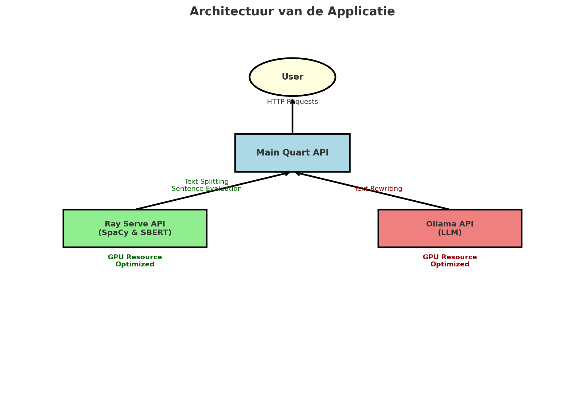

# Klopta Backend Documentatie

Deze documentatie geeft een overzicht van de Klopta-backend met de nadruk op de AI-modellen die in het systeem zijn geïntegreerd. Algemene API-documentatie is beschikbaar op `/api/docs` wanneer de container draait.

## AI-componenten

### **1. Zinsplitsing (SpaCy-gebaseerd)**  
- **Functionaliteit**: Groepeert zinnen op basis van gedeelde context, zoals onderwerp of verhaallijn. Zinnen met hetzelfde onderwerp of die een gedachtegang voortzetten, worden gegroepeerd voor betere verwerking.  
- **Gebruik**: Bereidt tekst voor op nauwkeuriger scoren en herschrijven door logische zinsgroeperingen te behouden.  
- **Implementatie**: Gebruikt SpaCy's Nederlandse taalmodel (`nl_core_news_md`) om zinnen contextueel te splitsen.

### **2. Zinsbeoordeling (BERT-gebaseerd)**  
- **Model**: Een aangepast Sentence-BERT (SBERT)-model, getraind voor stilistische gelijkenisanalyse.  
- **Dataset**:  
  - Model: [ODeNy/ChecketV2](https://huggingface.co/ODeNy/ChecketV2)  
  - Dataset: [ODeNy/ChecketV2-Dataset](https://huggingface.co/datasets/ODeNy/ChecketV2-Dataset)  
- **Functionaliteit**: Beoordeelt zinnen om te bepalen hoe goed ze overeenkomen met de schrijfstijl van originele website-inhoud.  
- **Gebruik**: Zorgt voor kwaliteitscontrole van herschreven of nieuwe inhoud door consistentie met een gevestigde stijl te evalueren.

### **3. Tekstherschrijven (Nederlands LLM)**  
- **Model**: Een fijn afgestemd Nederlands LLM: [BramVanroy/GEITje-7B-ultra](https://ollama.ai/models/BramVanroy/GEITje-7B-ultra).  
- **Implementatie**:  
  - Geoptimaliseerd met hyperparameters voor het herschrijven van Nederlandse teksten.  
  - Gebruikt geavanceerde prompt-engineering om coherente en contextueel passende herschrijvingen te garanderen.  
- **Functionaliteit**: Herschrijft teksten om de leesbaarheid te verbeteren en een consistente toon of stijl te behouden. Ideaal voor toepassingen zoals inhoudsverbetering of parafraseren.

## Architectuur

### Overzicht
De architectuur van de applicatie is ontworpen om **modulair**, **schaalbaar**, en **prestatief** te zijn. Door de AI-componenten te scheiden in interne API’s, blijft de **main Quart API** lichtgewicht en flexibel, terwijl GPU-resources optimaal worden benut.

---

### 1. Main Quart API
- **Functionaliteit**:  
  De Quart API fungeert als de kern van het systeem, verantwoordelijk voor:
  - Routeren van inkomende verzoeken naar de juiste interne API's.
  - Beheer van authenticatie (bijv. JWT).
  - Aggregatie en terugkoppeling van resultaten aan de gebruiker.
- **Voordelen**:  
  - **Lichtgewicht**: Quart is puur gericht op API-routing en logica, waardoor minimale overhead ontstaat.
  - **Flexibiliteit**: Eenvoudig te integreren met nieuwe AI-componenten.

---

### 2. Interne API’s

#### a. Zinsplitsing en zinsbeoordeling (Ray Serve)
- **Waarom Ray Serve?**  
  Ray Serve maakt het eenvoudig om schaalbare en prestatieve microservices te implementeren, geoptimaliseerd voor machine learning-modellen.
- **Architectuurdetails**:
  - **Modellen**:  
    - **SpaCy** voor zinsplitsing (`nl_core_news_md`).
    - **SBERT** voor zinsbeoordeling (getraind met de `ODeNy/ChecketV2-Dataset`).
  - **Implementatie**:  
    - Beide modellen draaien als afzonderlijke Ray Serve-actoren op een GPU-server.
    - De API is schaalbaar, afhankelijk van de belasting (bijvoorbeeld meerdere workers voor gelijktijdige verzoeken).
  - **Voordelen**:  
    - Efficiënte taakverdeling.
    - Eenvoudige integratie met de main Quart API via HTTP/REST.

---

#### b. Tekstherschrijven (Ollama API)
- **Waarom Ollama?**  
  Ollama biedt een schaalbare oplossing voor het draaien van grote taalmodellen (LLM's) zoals [GEITje-7B-ultra](https://ollama.ai/models/BramVanroy/GEITje-7B-ultra) op interne servers.
- **Architectuurdetails**:
  - **Model**: Het fijn afgestemde Nederlandse LLM draait in een afzonderlijke Ollama-instantie.
  - **Interactie**:  
    - De main Quart API communiceert met de Ollama API via HTTP.
    - Specifieke prompts worden dynamisch gegenereerd in de Quart API en doorgestuurd naar de Ollama-instantie.
  - **Voordelen**:  
    - Volledige GPU-toewijzing aan het LLM zonder interferentie van andere modellen.
    - Lagere latentie door directe GPU-toegang.

---

### 3. Voordelen van de Architectuur
- **Modulariteit**: Door de scheiding van de AI-modellen in interne API’s, kunnen modellen onafhankelijk worden geüpgraded of vervangen.
- **Schaalbaarheid**: Ray Serve en Ollama bieden ingebouwde mogelijkheden om belasting op te vangen door automatische schaalvergroting.
- **Minimale bottlenecks**:  
  - GPU wordt efficiënt benut door AI-modellen te isoleren.
  - Quart API blijft lichtgewicht en responsief.
- **Toekomstbestendig**: Nieuwe AI-componenten kunnen eenvoudig worden toegevoegd aan de architectuur zonder de bestaande services te verstoren.

## Ontwikkelingsbronnen

### **Projectrepository**  
De backend integreert deze AI-componenten in de verwerkingspipeline. Zorg ervoor dat je ontwikkelomgeving is geconfigureerd volgens de vereisten in de `devcontainer`- en instellingsbestanden van de repository.

### **Deployment**  
Ontworpen voor GPU-versnelde Docker-containers. Controleer de modelprestaties met ingebouwde tools van Ray Serve (admin-toegang vereist).

## Contactinformatie

Voor vragen of problemen:  
- **Naam**: bazaaer  
- **E-mail**: lander@vanderstighelen.net 